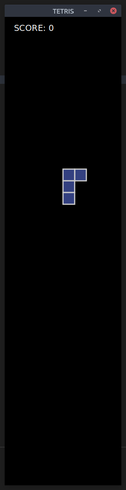
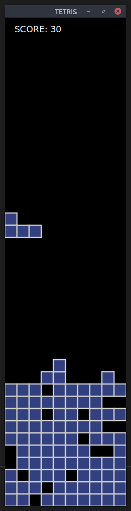
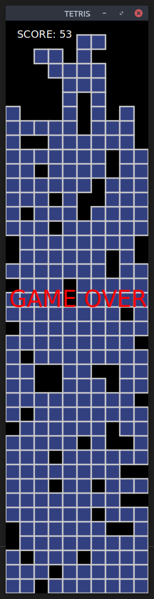

# PyTetris

A small weekend project to implement the game of Tetris in Python. Starting out
as a fun coding exercise, it turned out to be very playable and fun.


The game uses PyGtk for the UI, and has no other dependencies. Code is not 
fully documented, but is pretty strait forward. There are no tests.
This project is unlikely to get any more development.

## Usage

```sh
./PyTetris.py
```

This will start the application, open the game window, and start the game.

## Controls

The falling piece can be moved left or right using the respective arrow keys, 
the up key will rotate the piece clockwise 90 degrees. The down key will jump 
the piece down. Finally the spacebar will pause the game.

## Gameplay
Just like the Tetris you know and love. The game is over when the pile of 
pieces reaches the top. When a complete row is formed it will be removed and
the score will be incremented. Unlike most Tetris games the speed will not
increase with the score.





## Classes

### PyTetrisApp
This class is a minimal Gtk.Application subclass: naming the application, and
adding a single GameWindow object to the application.

### GameWindow
A Gtk.Window subclass, the window that appears on the screen. It creates a 
single Tetris widget, and handles feeding keypresses to that widget.  


### Tetris
This class is the focalpoint of the project. This widget is a Gtk.DrawingArea
subclass. It is the game, it complete handles drawing the game to itself and 
handles or deligates all game logic.

### Crumble
This class tracks the blocks at the bottom of the screen, it contains logic for
tracking blocks, removing completed rows, and when the top it reached. It
also handles drawing itself, via the Tetris.draw_block method.

### Tetromino
A class representing the current falling piece. It tracks all blocks by being 
given relative coords to a central block. It supplies methods to control the 
block, collision logic, it also handles drawing itself, via the 
Tetris.draw_block method.